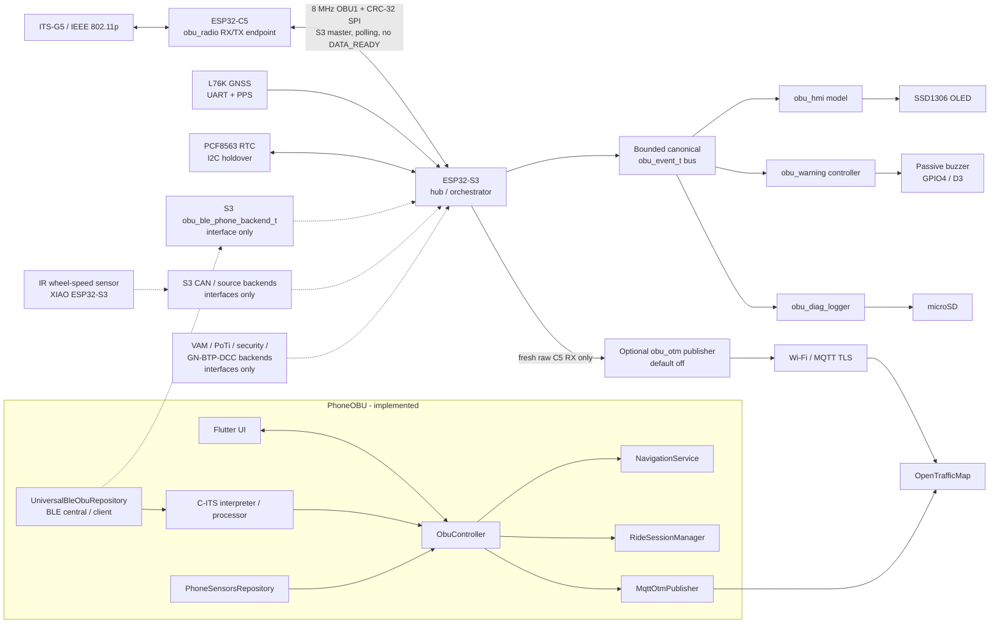

# Bicycle OBU

Bicycle-mounted research platform for cooperative transport, sensing and ride
data acquisition. The system separates the rider interface, embedded hub,
ITS-G5 radio and external sensors into independently versioned subprojects.

This is a research prototype. Experimental safety functions are not certified
and do not replace rider attention.

## Status

| Area | Current evidence |
|---|---|
| Phone application | Flutter Android/iOS application, BLE central/client, C-ITS processing, navigation and recording implemented |
| Wheel speed | IR through-beam sensor hardware, simulation and ESP-IDF firmware maintained as a submodule; optional CAN hardware interface is not integrated with the main OBU firmware |
| Main OBU | Modular ESP-IDF ESP32-S3 hub + ESP32-C5 ITS-G5 firmware, local OLED/buzzer, GNSS/time and diagnostic logging maintained as a submodule |
| System integration | S3 BLE peripheral, CAN/sensor integration and physical end-to-end validation pending |

Do not treat source review, CI compilation or simulation as complete-system
validation. Each subproject records its own implemented and pending verification
evidence.

## Architecture

Solid arrows below are implemented in the revisions pinned by this repository.
Dashed arrows are prepared contracts/interfaces that do not yet have an
end-to-end implementation in the pinned system.



The phone implements the BLE central/client, C-ITS interpretation, rider UI,
phone-sensor acquisition, navigation, canonical scientific ride recording and
an optional live-only OpenTrafficMap publisher. The pinned ESP32-S3 firmware
currently has only the `obu_ble_phone_backend_t` contract for the phone link; a
GATT peripheral/backend is not implemented yet, so the phone-to-S3 BLE path is
not an end-to-end implemented connection.

The ESP32-S3 owns the canonical `obu_event_t` data plane, GNSS/time handling,
local HMI/warnings and diagnostic SD logging. Its C5 link is the implemented
8 MHz versioned CRC SPI transport with the S3 as master and polling enabled;
the current prototype does not use a `DATA_READY` wire. The ESP32-C5 is the
ITS-G5 radio RX/TX endpoint. CAN/bicycle-sensor integration and the VAM/PoTi/
security/GN-BTP-DCC chain are explicit interfaces only in the pinned S3 code.
The optional S3 OpenTrafficMap path is implemented over Wi-Fi/MQTT TLS but is
disabled by default and publishes only fresh raw C5 RX frames.

## Subprojects

| Path | Repository | Scope |
|---|---|---|
| [`phone-app`](phone-app/) | [PhoneOBU](https://github.com/niklasdathe/PhoneOBU) | Flutter rider interface, BLE client, navigation, C-ITS processing and ride data |
| [`mainboard-protoype`](mainboard-protoype/) | [MainboardOBU-prototype](https://github.com/niklasdathe/MainboardOBU-prototype) | ESP32-S3 hub, ESP32-C5 ITS-G5 endpoint, GNSS/time, local HMI/warnings and diagnostic logging |
| [`sensors/IRBicycleWheelSpeedSensor`](sensors/IRBicycleWheelSpeedSensor/) | [IRBicycleWheelSpeedSensor](https://github.com/niklasdathe/IRBicycleWheelSpeedSensor) | 940 nm spoke sensor, KiCad hardware, simulation and ESP-IDF firmware |

Clone the complete system:

```bash
git clone --recurse-submodules https://github.com/niklasdathe/BicycleOBU.git
```

Initialize subprojects in an existing checkout:

```bash
git submodule update --init --recursive
```

## System constraints

- The intended phone-to-hub interface is Bluetooth Low Energy. The phone-side
  central/client and GATT contract are implemented; the pinned S3 firmware still
  requires its BLE peripheral/backend implementation.
- The embedded architecture separates application/hub functions on the
  ESP32-S3 from ITS-G5 radio functions on the ESP32-C5.
- Loss of the phone must not stop embedded acquisition or configured local
  warning/HMI functions.
- Repeated receptions for one active DENM event must not create repeated rider
  notification episodes, while raw receptions remain available for logging and
  forwarding.
- Wired bicycle modules are expected to use the shared CAN architecture defined
  by the requirements; final carrier/connectors, the CAN backend and electrical
  integration remain subject to implementation and hardware validation.
- Mechanical assemblies must withstand bicycle vibration and environmental
  exposure; no enclosure or ingress-protection claim has been validated.
- Raw acquisition time, arrival time and data provenance must remain distinct
  across transport and storage boundaries.

## Planned components

| Component | Intended role | State |
|---|---|---|
| Main OBU | Embedded hub, radio gateway, local warning/HMI, time and diagnostic storage | Prototype firmware implemented; HIL integration pending |
| ITS-G5 radio | Receive and transmit cooperative transport messages | C5 endpoint implemented; RF/ETSI conformance verification pending |
| IMU modules | Distributed bicycle motion measurements | Investigation |
| Smart lighting | Vehicle-bus-controlled head and tail lighting | Investigation |
| Energy system | Dynamo input, battery charging and regulated system power | Investigation |

## Source of truth

- The versioned requirements workbook defines system acceptance and architecture constraints.
- Each subproject README and `docs/` directory own implementation-specific evidence.
- Git submodule pins identify the exact revisions integrated into this system repository.
- Hardware-in-the-loop, RF, timing, warning and endurance tests remain necessary where the requirements prescribe physical verification.

## License

No project license has been selected. Until one is added, this repository and
its subprojects must not be presented as granting hardware, software or
documentation reuse rights.
